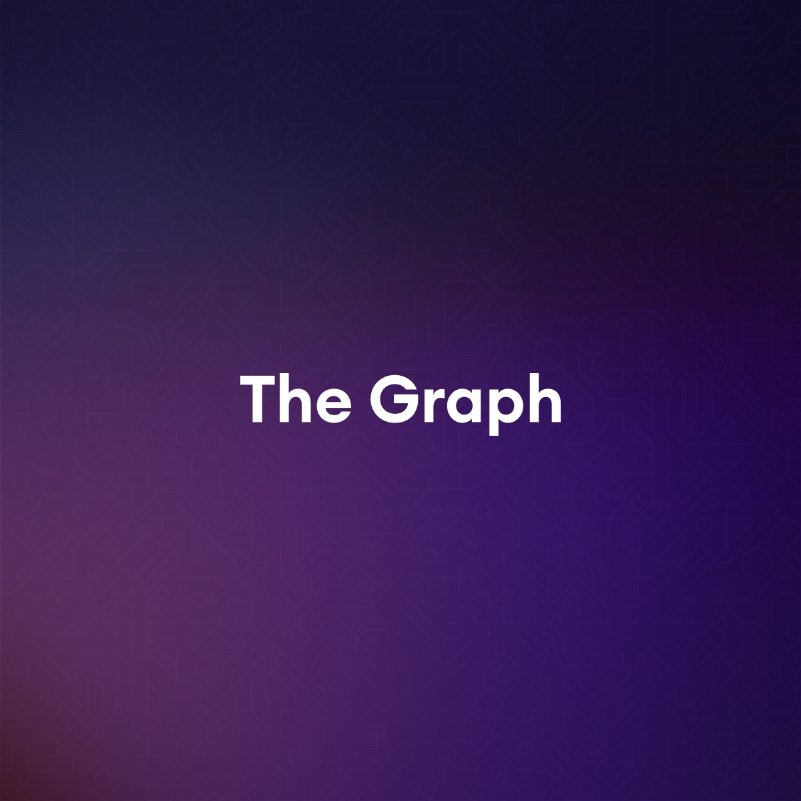

import { Cards } from 'nextra/components'

{<h1 className="mt-10 mb-4 text-center text-[2.5rem] font-bold tracking-tight">Showcase</h1>}

{
Open
source projects powered by Nextra
}

<Cards>
  <ShowcaseCard title="The Graph" href="https://thegraph.com/docs/en">
    <></>
  </ShowcaseCard>
</Cards>

export const ShowcaseCard = Object.assign(
  Cards.Card.bind(),
  {
    displayName: 'ShowcaseCard',
    defaultProps: {
      image: true,
      arrow: true,
      target: '_blank'
    }
  }
)

